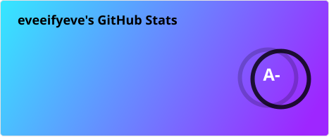
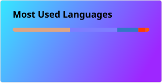
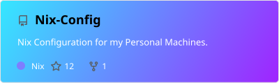
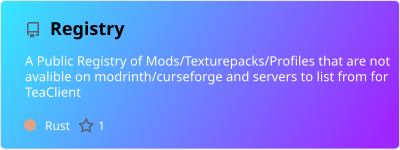
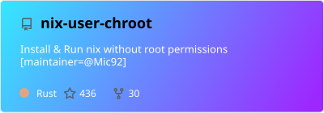

<!-- `> nix run .#skillIcon` -->  

<!-- BEGIN mdsh -->
 

<!-- END mdsh -->

Hi, I am Eveeifyeve 👋
-------------------------
*   🌍 I'm based in Australia
*   🔭  I'm currently trying to get [software contract clients for DigitalBrewStudios](https://digitalbrewstudios.com/contact-us)
*   🚀 I'm currently working on: [TeaClient](https://teaclient.com) (Quality of Life Minecraft Client) & [Nix-Windows](https://github.com/DigitalBrewStudios/nix-windows)
*   🌟  I specialize in [making software.](https://digitalbrewstudios.com/contact-us)
*   ✉️ You can contact me [here](https://eveeifyeve.dev/contact)

    
Github Stats ⚡️✍️

    

    

    
Roles ✍️✍️

<!-- `> nix run .#roles` -->

<!-- BEGIN mdsh -->
### Businesses
- DigitalBrewStudios: Owner/Proprietor,
- OpusClient: Senior Software Engineer,
- NodeForge: Senior Software Developer (2024-2025),
- DuvanMC: Junior Software Developer (2024)

### Opensource Projects
- Nixpkgs: Windows Enablement and Packaging Team Member & Nim Packaging Team Member
<!-- END mdsh -->

    

<!-- `> nix run .#pin-tags` -->

<!-- BEGIN mdsh -->

<!-- END mdsh -->

<picture>
  <source media="(prefers-color-scheme: dark)" srcset="https://raw.githubusercontent.com/eveeifyeve/eveeifyeve/output/snake-dark.svg" />
  <source media="(prefers-color-scheme: light)" srcset="https://raw.githubusercontent.com/eveeifyeve/eveeifyeve/output/snake.svg" />
</picture>
